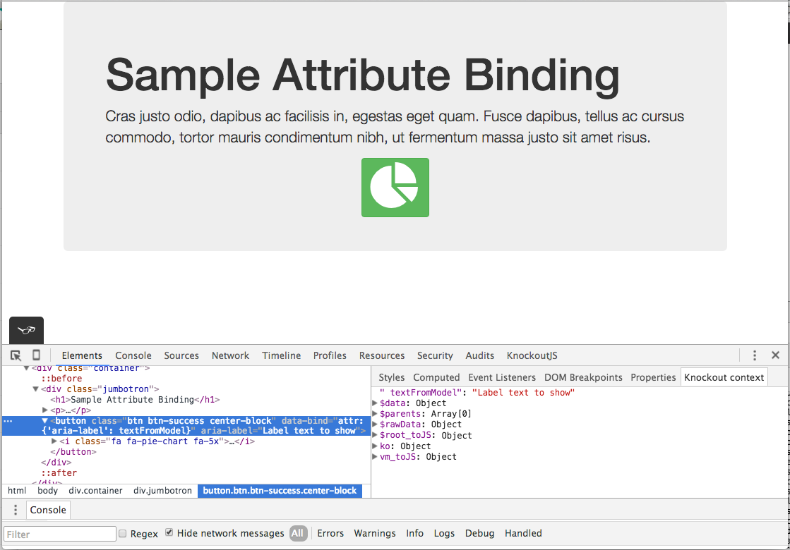

Sample Attribute Binding
========================

This is a quick project to test out the StackOverflow question: 
[data binding aria label not working on button tag](http://stackoverflow.com/questions/35214371/data-binding-aria-label-not-working-on-button-tag?noredirect=1#comment58155528_35214371).

To see the sample, run the following commands to install the dependencies:

    npm install
    bower install
    
Then open the ```index.html``` file in Chrome and inspect the button element.  It should look something like the screen shot below:





Knockoutjs Context Debugger
---------------------------
The above image shows the [Knockoutjs context debugger](https://chrome.google.com/webstore/detail/knockoutjs-context-debugg/oddcpmchholgcjgjdnfjmildmlielhof)
in action.

Tota11y
-------
The small "glasses" icon at the bottom of the page is the [tota11y](https://khan.github.io/tota11y/) script running.  It
is a toolkit from [Kahn Academy](https://www.khanacademy.org) that helps web designers detect accessiblity issues.  
Click on the icon and try it out.